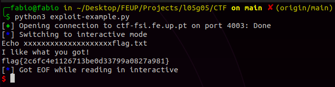
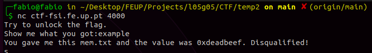
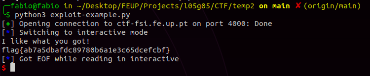

# CTF 2 - Semana 5

## Primeira parte

Inicialmente exploramos os ficheiros disponibilizados na plataforma CTF que são os mesmos que estão a ser executados no servidor na porta 4003. 

Com o comando **checksec** verificamos que `program` (main.c compilado) tem arquitetura x86, o seu binário não está randomizado, não existem proteções do endereço de retorno usando canários nem proteções de execuções ao nível da stack.

```bash
$ checksec program
```

Depois avaliamos o funcionamento do código `main.c`. Verificamos que existe alocação de 8 bytes de memória para o nome do ficheiro `meme_file` e 20 bytes para a resposta do utilizador `buffer`. 

```c
char meme_file[8] = "mem.txt\0";
char buffer[20];
```

Verificamos também que a função `scanf` permite a cópia de até 28 bytes provenientes do `stdin` para o buffer anteriomente declarado. Isto permite que na situação em que o input é superior a 20 bytes ocorra um buffer overflow.

```c
scanf("%28s", &buffer);
```

Segundo o funcionamento da stack, a zona de memória alocada é contínua e depende da ordem da declaração das variávies. Então, se excedermos a capacidade do buffer acabamos por reescrever a zona de memória dedicada a `meme_file`. Como as instruções seguintes de `main.c` mostra o conteúdo de meme_file, é do nosso interesse reescrever o nome do ficheiro a ler, de modo a mostrar o conteúdo de `flag.txt`.

No programa python disponibilizado, na zona em que injetamos o conteúdo para o servidor, bastou escrever 20 caracteres seguidos do nome do ficheiro que queremos ler.

```python
r.sendline(b"xxxxxxxxxxxxxxxxxxxxflag.txt")
```

Ao executar conseguimos ter acesso ao conteúdo do ficheiro `flag.txt` e à flag do desafio, `flag{2c6fc4e1126713be0d33799a0827a981}`.



## Segunda parte

Assim como no primeiro desafio, optamos por verificar as proteções do programa que roda no servidor. `program` continua a ter arquitetura x86, o seu binário não está randomizado, não existem proteções do endereço de retorno usando canários nem proteções de execuções ao nível da stack.

Depois analisamos o código de `main.c`. Existe alocação de 8 bytes de memória para o nome do ficheiro `meme_file`, 4 bytes para um valor `val` e 20 bytes para a resposta do utilizador `buffer`. 

```c
char meme_file[8] = "mem.txt\0";
char val[4] = "\xef\xbe\xad\xde";
char buffer[20];
```

Verificamos que a técnica a usar é semelhante ao desafio anterior, no entanto o conteúdo do ficheiro só era mostrado quando o valor em `val` fosse 0xfefc2223.

O ouput inicial do programa é sempre o mesmo e revela o valor inicial de `val` declarado:



Com essa informação pudemos reconstruir os bytes que deveriam constar em `val` para este ser igual a 0xfefc2223.

```
"\xef\xbe\xad\xde" > 0xdeadbeef
0xfefc2223 > "\x23\x22\xfc\xfe"
```

No programa python disponibilizado, na zona em que injetamos o conteúdo para o servidor, bastou escrever 20 caracteres seguidos do novo valor de `val` e nome do ficheiro que queremos ler.

```python
r.sendline(b"xxxxxxxxxxxxxxxxxxxx\x23\x22\xfc\xfeflag.txt")
```

Ao executar conseguimos ter acesso ao conteúdo do ficheiro `flag.txt` e à flag do desafio, `flag{9b9af7659b2188312cd6f82ca492f09e}`.


