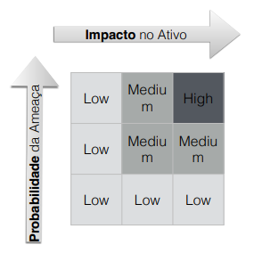

# 2 - Segurança

Os sistemas devem ser correctos, tanto a nível de inputs como de formatação da informação. Deve prever potenciais ataques e não comprometer dados sensíveis dos utilizadores.  
No entanto isto não é o suficiente. A segurança é um processo contínuo, onde se cria novas defesas a partir da invenção de novos ataques, ambicionando um equilíbrio ao longo do tempo. Há três eixos essenciais:

1. **Confidencialidade** - segredo, privacidade;
2. **Integridade** - não alteração de dados, dados fidedignos e autênticos;
3. **Disponibilidade** - existência, constância;

## 2.1 - Modelos de Segurança

### 2.1.1 - Binário

Característico das criptografias. Há caracterização formal do atacante e dos objectivos da segurança do sistema, de forma a garantir que naquele modelo nenhum ataque poderá ocorrer.

#### Desvantagens

- Demasiado tempo usado numa fase inicial;
- Implementação da segurança sem ter em conta o custo monetário;
- Não útil para sistemas complexos;
- É abstrato e não aplicável em sistemas concretos / reais;
- Ignora problemas reais (por exemplo side-channels);

### 2.1.2 - Gestão de Risco

Característico da engenharia de software e segurança no mundo real. Minimiza os riscos de ataques em função das ameaças mais prováveis. Equilibra o possível custo com as potenciais perdas. É necessário ter resiliência, mitigar os problemas e ter sempre em conta o risco.

#### Desvantagens

- Pode haver incorreção na análise do risco;
- Mesmo com este modelo, não há segurança total;
- Uma ameaça mal classificada pode deitar tudo por terra;

#### Matriz de análise de risco

Existem dois eixos: os ativos (recurso que detém valor para um ator do sistema, como informação, reputação/imagem, dinheiro/recurso, infra-estrutura) e as ameaças. 

    
    
Figura 1: Matriz de risco

## 2.2 - Algumas terminologias

### 2.2.1 - Vulnerabilidade

Falha que está acessível a um adversário que pode ter a capacidade de a explorar. Tem geralmente origem em erros de concepção:

- Software de má qualidade;
- Análise de requisitos desadequada;
- Configurações erradas;
- Utilização errada;

### 2.2.2 - Ataques

Ocorre quando alguém tenta explorar uma vulnerabilidade. Existem ataques ativos (adivinhar passwords), passivos (eavesdropping) e Denial of Service. Quando um ataque é bem sucedido, diz-se que o sistema foi comprometido.  
Estrutura de um ataque (MOM):

1. Motivo/Ameaça;
2. Oportunidade/Vulnerabilidade;
3. Método/Exploit;

### 2.2.3 - Ameaça

A fonte da motivação para causar perda de valor. Exemplo: perturbar o normal funcionamento do sistema, negligência, acidente natural. Algo que está na origem da potencial perda do valor.

### 2.2.4 - Exploit

Meio de fazer um ataque, materialização da perda de valor.

## 2.3 - Reporting

As novas vulnerabilidades aparecem todos os dias e há um esforço mundial para catalogar, identificar, divulgar e detectar as mesmas. Motivos:

- Quando uma vulnerabilidade está bem documentada, há garantia nos sistemas que a conhecem que não há exposição a ameaças;
- Capacidade de generalizar vulnerabilidades para obter robustez para aquela gama de ataques;

### 2.3.1 Zero-Day Vulnerability

Vulnerabilidade/Exploit que só um grupo muito restrito de pessoas sabem que existe. É usada como arma e o negócio pode chegar a milhares de dólares. 

