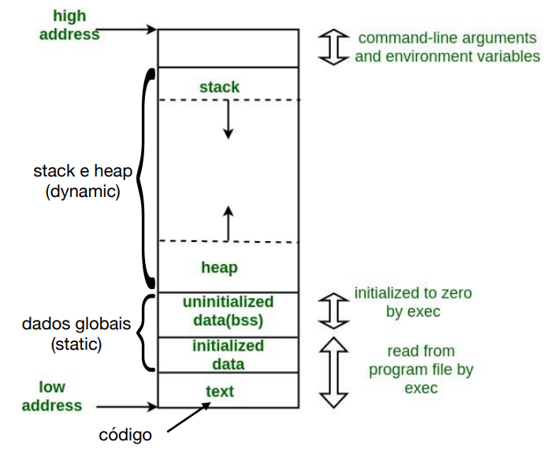

# 3 - Controlo de Software

O software pode ser manipulado para causar dano nos sistemas. É importante estudar vulnerabilidades e ataques anteriores, para blindar o novo código de ser controloado externamente. Chama-se `usurpação de controlo` quando um input externo leva o programa a quebrar a sequência de instruções que está idealizada

## 3.1 - Modelo de memória

Do endereço menor para o endereço maior temos:

- **Text**, onde tem o código a executar;
- **Data**, onde teo os dados globais e estáticos;
- **Heap**, armazena a memória dinamicamente;
- **Stack**, armazena a informação como endereços de retorno, variáveis locais e argumentos para as funções;

    
    
Figura 1: Esquema de memória

### 3.1.1 - Funcionamento da Stack

A stack cresce de cima para baixo, com a função main() no topo. Cada chamada a funções regista na stack o endereço de retorno, as variáveis locais e os parâmetros da função a chamar. A frame é delimitada pelo frame pointer da função anterior e o stack pointer. Antes do stack pointer existe o return address. 

## 3.2 - Stack Smashing / Buffer overflow na stack

Ataque documentado desde 1972. Há funções como o **strcmp** que copia uma string para um apontador de variável local até ocorrer um `\0`. Ou seja, poderá corromper o frame pointer anterior e o endereço de retorno. Erros deste tipo normalmente resultam em segmentation fault, quando um processo está a escrever fora da sua zona de memória. No entanto, o endereço de retorno pode ser manipulado para apontar para um código do atacante (por exemplo, um código bash "shell code").

### 3.2.1 - Shell Code

- Codificado em código máquina;
- Sequência de instruções que executam instruções shell;
- Precedido por instruções NOP porque o seu endereço pode variar e assim há mais probabilidades de acertar;
- Um problema é não conter \0 no código, pois o strcmp pára assim que encontrar este caracter e pode estragar o código injectado;

### 3.2.1 - Off-by-one

Um byte é escrito fora da variável local, logo permite escrever o byte menos significativo do frame pointer anterior.

## 3.3 - Overflows na Heap

Pode também haver endereços alocados na Heap, através de:
- virtual functions (há uma tabela de apontadores na Heap)
- programa que depende de bibliotecas do sistema. Em runtime essas dependências são carregadas para a memória e para isso é necessário existir endereços;
- tratamento das excepções;

O armazenamento das estruturas da heap são maioritariamente efetuadas por listas ligadas. São exemplos as operações malloc/free. Assim, basta tentar exceder a capacidade de escrita de uma unidade para tentar reescrever para onde aponta.

Apesar de ser muito mais complexo definir apontadores na heap, já que é gerida dinamicamente ao contrário da stack, o exploit pode ser conseguido.

### 3.3.1 - Heap Spraying

Os browsers correm código do servidor (possivelmente malicioso) no lado do utilizador. O código poderá alocar dinamicamente o máximo de scripts maliciosos com nops para ter mais probabilidade de ser executado.

### 3.3.2 - Use After Free

Em linguagens de baixo nível como C/C++, um código malicioso pode ser alocado e, mesmo depois de um free(), poder ser executado com endereços escolhidos pelo atacante. O código pode chamar um método de uma instância destruída sem ocorrer um erro no sistema.

## 3.4 - Overflows de Inteiros

A truncatura por passagem para tipo mais pequeno ou uma adição/multiplicação poderá provocar uma troca de sinal (o inteiro passa de positivo para negativo). Assim há erro no tamanho das estruturas a alocar, o que pode provocar erros ou buffer overflow. 

## 3.5 - Strings de Formatação

Por exemplo na função printf(). 